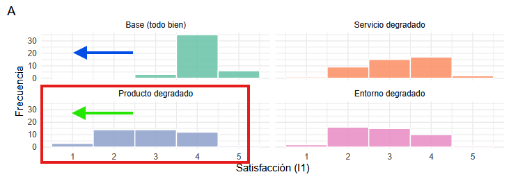
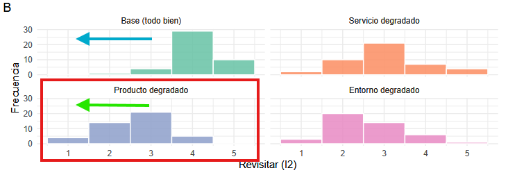
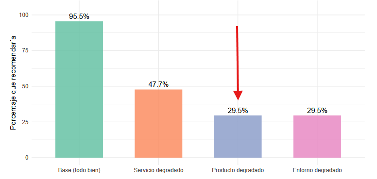
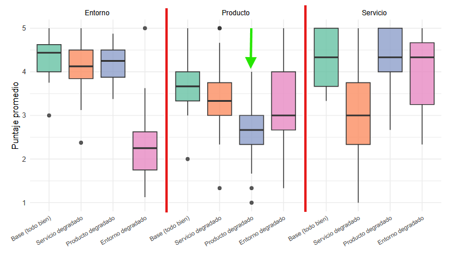
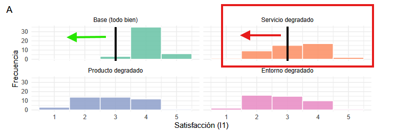

```{r setup, include=FALSE}
knitr::opts_chunk$set(
  echo    = FALSE,
  message = FALSE,
  warning = FALSE,
  comment = "#>",
  fig.pos = "H",
  fig.width  = 7,
  fig.height = 4,
  out.width  = "95%",
  fig.align  = "center"
)

options(knitr.table.format = "latex")
```
\newpage

# Objetivo General

> *Determinar cómo los tres factores de la experiencia gastronómica: calidad del producto, calidad del
servicio y entorno, impactan en la toma de decisiones del comensal.*

## Conclusión General

Queda estadísticamente demostrado que la variación del nivel de calidad para cada dimensión de la experiencia culinaria (producto, servicio y entorno) impacta, en efecto, sobre las tres variables que constituyen la toma de decisiones del comensal: Satisfacción, Intención de Revisitar (ver Resultado 2.1) y Recomendar o no (ver Resultado 2.2.). Además, el tamaño de este efecto es considerable en las tres variables dependientes.


Por lo demás el análisis paramétrico (ANOVA de Welch) ratifica este hallazgo, lo cual brinda solidez a esta conclusión. 


## Objetivo Específico: Impacto de la Manipulación del Producto

> *Identificar de qué manera los cambios en la calidad del producto influyen en la toma de decisiones del comensal.*

### Impacto de la Manipulación del Producto sobre la Satisfacción

Para detallar los resultados estadísticos del impacto específico de la manipulación del producto sobre la Satisfacción del comensal, tenemos el siguiente gráfico:

```{r, echo=FALSE, fig.cap="Impacto de la Manipulación de las variables independientes sobre la Satisfacción del Comensal.", out.width="70%", fig.align="center"}

```

En la Figura 1 apreciamos que a resultas de la degradación del Producto (zona recortada en rojo) el nivel de Satisfacción se desplaza hacia la izquierda (flecha verde, comparada con la flecha azul, que grafica la distribución de los puntajes en la línea base).

```{r, echo=FALSE, fig.cap="Impacto de la Manipulación de las variables independientes sobre la Intención de Revisitar del Comensal.", out.width="70%", fig.align="center"}

```

En la Figura 2 puede comprobarse que, en comparación con la línea de base, las puntuaciones de los comensales en cuanto a la Intención de volver al local disminuyen cuando el Producto es degradado, desplazándose hacia la izquierda (flecha verde).

```{r, echo=FALSE, fig.cap="Impacto de la Manipulación de las variables independientes sobre la Intención de Recomendar del Comensal.", out.width="70%", fig.align="center"}

```

La Figura 3 nos muestra que el impacto de degradar el Producto es, junto con el de degradar el entorno, el que mayor menoscabo genera en la intención de recomendar el local por parte del comensal. 

A modo de resumen, podemos ver en el cuadro siguiente (Figura 4) la comparación integral de cómo se comportan todas las variables independientes. Comprobamos que la variable Producto muestra (según indica la flecha verde) sus valores más bajos cuando se degrada experimentalmente tal variable. Esto es una validación indirecta que corrobora que la manipulación produce el efecto que anticipábamos. 

```{r, echo=FALSE, fig.cap="Comparación Integral de las variables independientes según manipulación.", out.width="70%", fig.align="center"}

```

## Objetivo Específico: Impacto de la Manipulación del Servicio

> *Identificar de qué manera los cambios en la calidad del servicio influyen en la toma de decisiones del comensal.*

### Impacto de la Manipulación del Servicio sobre la Satisfacción

Para detallar los resultados estadísticos del impacto específico de la manipulación del servicio sobre la Satisfacción del comensal, volvemos a ver el mismo gráfico indicado en la Figura 1, solo que esta vez  hacemos hincapié en los resultados de la variable Servicio (Figura 5):

```{r, echo=FALSE, fig.cap="Impacto de la Manipulación de las variables independientes sobre la Satisfacción del Comensal.", out.width="70%", fig.align="center"}

```

Encontramos que, en efecto, la satisfacción en efecto declina con la manipulación de la variable, en comparación con la línea base. Este efecto es estadísticamente fiable (puede verse el detalle numérico en la tabla resumen en el anexo de contraste de hipótesis).


